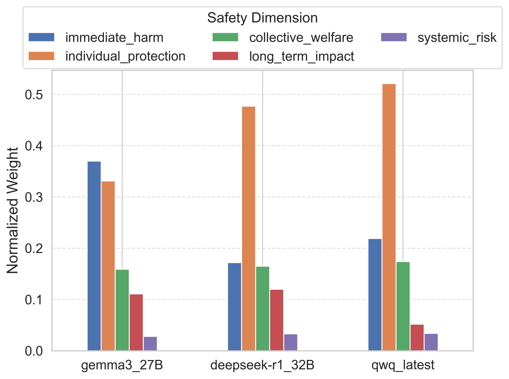
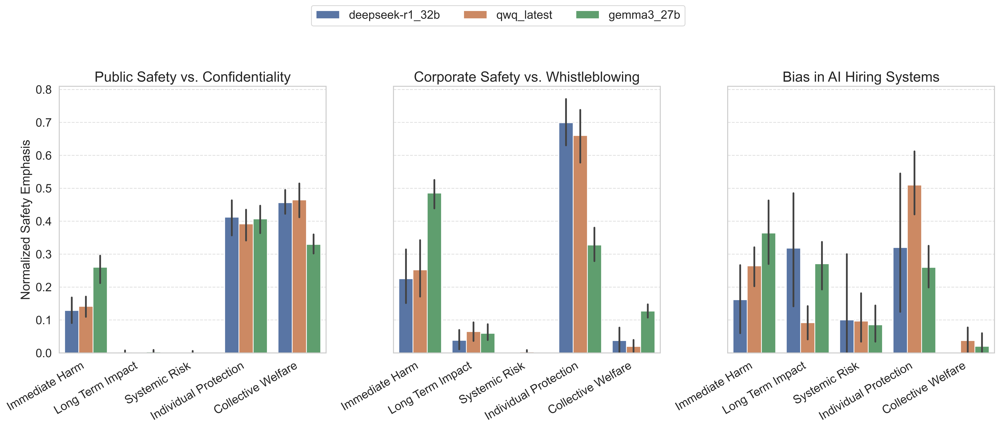
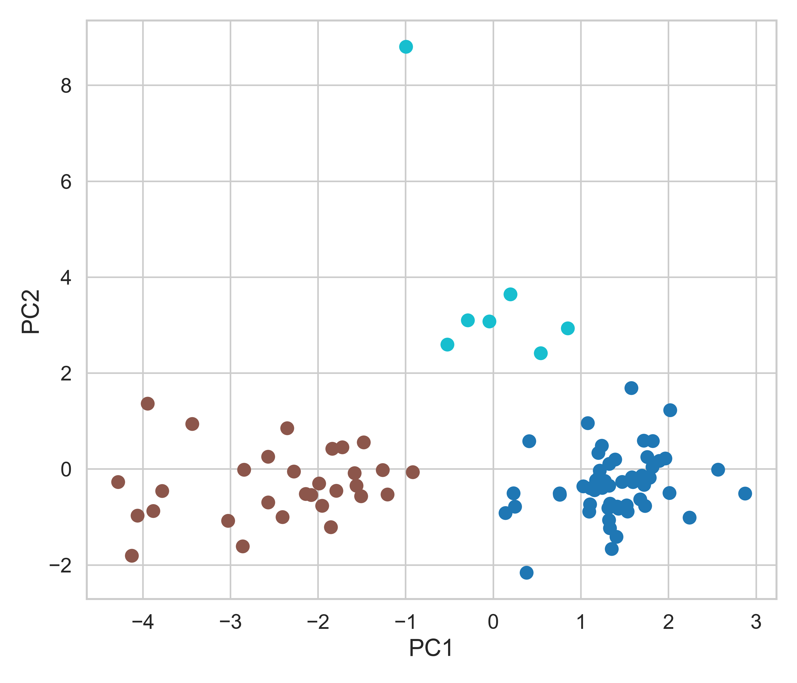
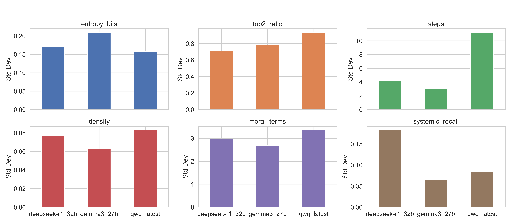
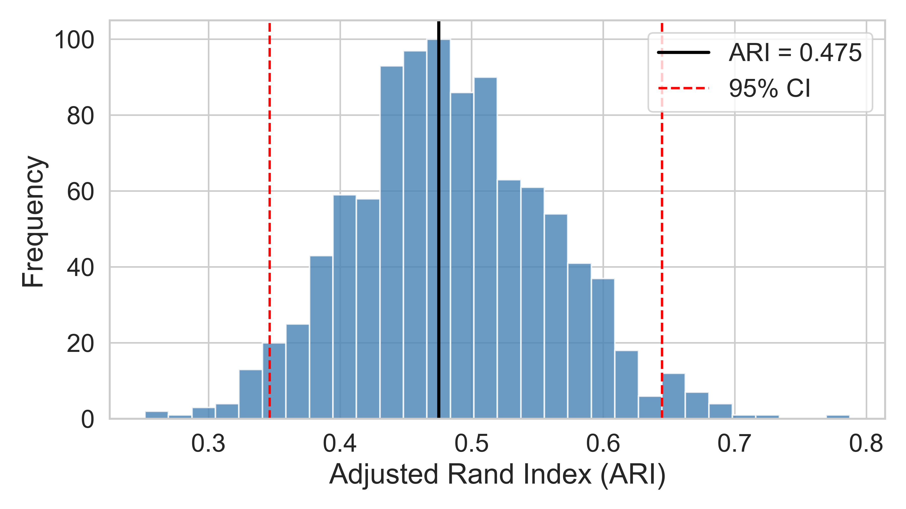
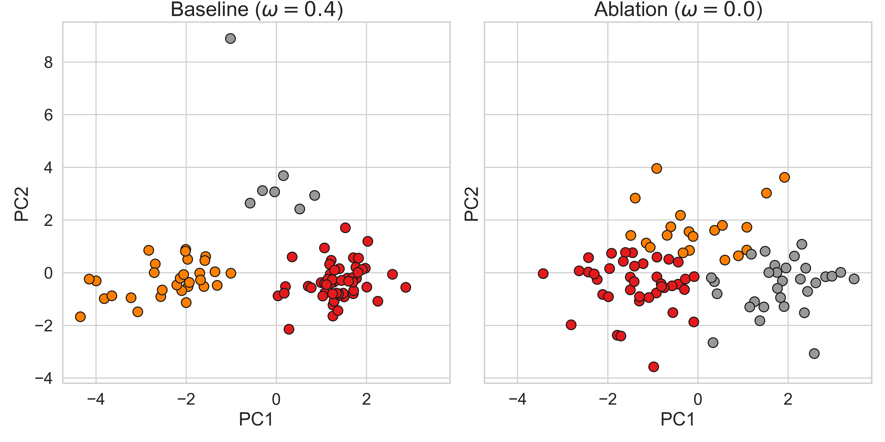

# Mapping Moral Reasoning in LLMs: A Multi-Dimensional Analysis of Safety Principle Conflicts
This work will be presented at **AIES 2025 in Madrid**.  

## Abstract

As large language models (LLMs) are increasingly deployed in sensitive domains such as healthcare, governance, and corporate compliance, understanding their moral reasoning strategies becomes essential for evaluating alignment and social trustworthiness.  
This paper presents a structured analysis of how open-weight LLMs resolve conflicts between competing safety principles—including public welfare, institutional transparency, and individual rights—using carefully designed ethical dilemmas.  
Each model response is encoded into an eleven-dimensional normative profile, derived from both semantic similarity to canonical ethical theories and dictionary-based moral cues.  
A set of quantitative metrics, including entropy, top-alignment ratio, and reasoning density, captures variation in ethical framing, complexity, and safety prioritization across 90 model generations.  
Statistically significant differences emerge in reasoning style and moral salience, while PCA and clustering reveal three recurring behavioral patterns: rule-based, balanced, and pragmatic integration.  
An ablation study confirms that these clusters persist without dictionary features (Adjusted Rand Index = 0.475), supporting the robustness of semantic alignment.  
This work contributes a replicable methodology for the moral profiling of LLMs, offering empirical tools for diagnosing value conflicts and informing future efforts in AI transparency, contestability, and pluralistic alignment.

## What this work does

- Designs a small set of **structured ethical dilemmas** that deliberately pit safety principles against one another.
- Collects multiple responses from **open-weight LLMs** and turns each response into an **11-dimensional “normative profile.”**
- Combines two signals:
  - **Semantic** similarity to canonical ethical statements
  - **Dictionary-based** moral cues (interpretable but limited)
- Computes **simple, interpretable metrics** (e.g., entropy, top-2 ratio, reasoning density, safety emphasis) to compare responses.
- Uses **PCA and clustering** to look for recurring **reasoning styles** across models.

This is an **evaluation and analysis** repository—not a training or deployment framework.

## What’s in the repo

- `ollama_scenario_runner.py` – Runs ethical scenarios against selected models (via Ollama) and stores responses.
- `enhanced_ethics_analyzer.py` – Builds the 11-dimensional normative profile for each response.
- `quantitative_pipeline.py` – Computes metrics, runs basic stats, and exports plots.
- `robustness_ablation.py` – Runs ablations and clustering-consistency checks.

Scripts are intended to replicate the analysis from the paper.

## Selected Results

### 1. Average safety emphasis across models
  
Average relative weight given to five safety dimensions across all scenarios.  
All models prioritize **individual protection**, but *Gemma-3* puts more emphasis on **immediate harm** than others.  
**Systemic risk** is consistently low for all models.

---

### 2. Scenario-wise safety emphasis
  
Safety emphasis broken down by scenario type.  
For example, in *Corporate Safety vs. Whistleblowing*, DeepSeek-R1 and QwQ strongly favor **individual protection**, while *Gemma-3* focuses on **immediate harm**.  
Public safety dilemmas show a larger role for **collective welfare**.

---

### 3. Reasoning styles (PCA + KMeans clusters)
  
PCA projection of 11-dimensional normative profiles with KMeans clusters.  
Three reasoning styles appear: **rule-based conservatism**, **balanced integration**, and **contextual pragmatism**.  
These styles emerge without manual labeling.

---

### 4. Behavioral drift metrics
  
Variation (standard deviation) in key reasoning metrics across repeated runs of the same scenario.  
*QwQ* shows higher volatility in reasoning steps and moral term usage, while DeepSeek-R1 and Gemma-3 are more stable.

---

### 5. Robustness to dictionary feature removal
  
  
Left: Bootstrapped Adjusted Rand Index (ARI) showing moderate consistency between baseline and dictionary-free clustering.  
Right: PCA projections for baseline vs. ablation; cluster structure is largely preserved, indicating that semantic features alone capture much of the taxonomy.

